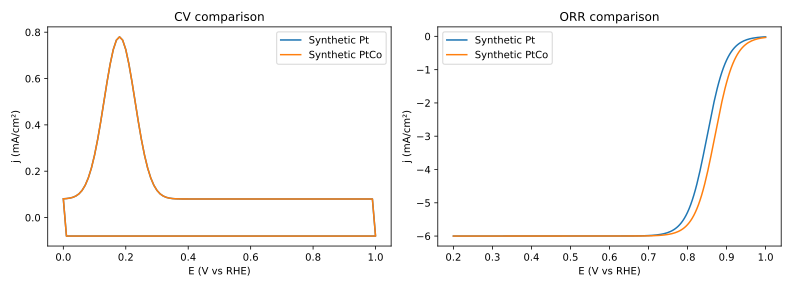

# PEMFC Electrocatalyst Activity Analyzer

Offline **CV / ORR analysis** for catalyst R&D: ECSA, mass activity, specific activity, QC, multi-sample comparisons and multi-rpm Koutecký–Levich fitting.

**[Open the workbench](https://andypeng09.github.io/PEMFC-Electrocatalyst-Activity-Analyzer/)** · **[Download current HTML](https://raw.githubusercontent.com/ANDYPENG09/PEMFC-Electrocatalyst-Activity-Analyzer/main/index.html)** · [Releases](https://github.com/ANDYPENG09/PEMFC-Electrocatalyst-Activity-Analyzer/releases) · [Methods and export schema](docs/methods-and-exports.md)

Current source: **v1.2.2**. One self-contained `index.html`, English / 中文, no installation or data upload. Download/save the HTML to use offline; a raw download link may display source text in your browser.



*Illustration uses synthetic curves, not experimental performance claims.*

## Start in one minute

1. Open the workbench or save and open `index.html` locally.
2. Click **Load Example Data** for the original calculators, or **Load two-sample demo** in the Analysis Workbench.
3. For your data, fill CV and O₂/N₂ LSV, confirm current units, scan rate, Pt loading and potential reference. Give each sample a unique name and click **Analyze & add current sample**.
4. Select samples to compare. Inspect QC explanations before interpreting metrics; choose which CV/LSV panels to export.
5. Download results/curve points with `summary.csv`, analysis with JSON, and raw samples/settings with **Back up history**.

History is stored in the current browser. JSON backup is the portable copy to keep before moving the HTML, changing browsers or clearing storage.

## What it includes

| Task | Result |
|---|---|
| H-upd CV integration | ECSA with baseline and integration-bound settings |
| O₂/N₂ LSV | Background subtraction, automatic plateau detection, E½, MA/SA and Tafel diagnostics |
| Quality checks | Explained Good / Check recommended / Invalid status |
| Multi-sample workflow | Naming, history, restore inputs, CV/LSV overlays and selective figures |
| Multi-rpm K–L | Signed fit, R², kinetic current; optional n with supplied electrolyte constants |
| Exports | Exact plotted points, per-sample metrics, units, settings and QC |
| Existing Python utilities | Autolab `.paax`, Origin `.opju`, formulas and plotting |

The workbench does not silently substitute `min(j)` for a diffusion plateau. QC thresholds are screening heuristics; they do not certify standards compliance. ECSA is a method-dependent estimate, and transport-limited activity estimates need review.

## Python and validation

```bash
pip install -r requirements.txt
python run_analysis_example.py --plot
python -m unittest discover -s tests -v
python build_html.py --check
npm ci
npm test
```

Edit maintained workbench files in `web/`, then run `python build_html.py` and commit the rebuilt HTML. CI repeats the numerical, JS/Python parity, DOM and build-consistency checks on pushes and pull requests. DOM tests mock canvas/image I/O; they are not browser-pixel tests.

The existing Pages site publishes the separate `gh-pages` branch. After validation, synchronize `index.html` from the reviewed source commit to that branch and record the source SHA in `commit.txt`. Updating `main` alone does not update the live site. Keep the existing Pages source and visibility settings.

## Connect analysis to experiment planning

Join `results.csv` to an experimental-design table by `sample_id`, retaining QC and units. See [BO handoff](docs/bo-handoff.md). The companion [BO planner](https://github.com/ANDYPENG09/bayesian-optimization-electrocatalyst) filters `Invalid` results and forecasts constraint feasibility; synthetic examples demonstrate the interface.

[Changelog](CHANGELOG.md) · [MIT License](LICENSE) · Author: [Yu Peng](https://github.com/ANDYPENG09)
